## Cryptography, the science of secret writing

### Week 1
#### Terminology

- Cryptography is the study of mathematical techniques related to aspects of information security such as confidentiality, data integrity, entity authentication, and data origin authentication.
- Steganography, the science of hiding messages in other messages or images.
- CIA triad, that means confidentiality, integrity and availability
- Confidentiality, **no improper disclosure of information** (Information is not learned by unauthorized principals).
- Integrity, **no improper modification of information** (Information has not been modified by unauthorized principals).
- Availability, **no improper impairment of functionality / service** (Information can be accessed by authorized principals).
- Identification, associating an identity with a subject.
- Authentication, verifying the validity of something (usually the claimed identity of a system entity), **Principals or data origin can be identified accurately**.
- Authorization, granting or denying the permissions of a system entity to access a resource.
- Accountability, the requirement for actions of an entity to be traced uniquely to that entity.
- Physical access controls, controls access to physical resources, such as a PC or paper records.
- Logical access controls, controls access to electronic systems and resources, such as databases and electronic records.
- Discretionary access control (DAC), the owner of the object decides which subjects have which privileges.
- Mandatory access control (MAC), system-wide policies define subject access to objects, and owners cannot change this.
- Role based access control (RBAC), access is based on a common set of privileges that apply to all subjects in the same role.
- Rule-based access control (RAC), access to objects is based on a list of rules defined by the owners for each subject.
- A Reference Monitor is a mechanism used to enforce access control policies, Reference Monitor must be NEAT: Non-bypassable, Evaluable, Always Invoked, Tamper-proof.

#### Other
- Access Control Matrix Model, a protection state (relative to a set of privileges **P**) is a triple (**S**,**O**,**M**).
- Matrix ***need to write !!!!***

### Week 2
#### General cryptographic schema

- A message is to be transferred from one principal (Sender) to another (Recipient) across some sort of Internet service.
- Plaintext ***P***, Encryption ***E***, Ciphertext ***C***, Decryption ***D***
- **Symmetric** algorithms, ***Key1 = Key2***
- **Asymmetric** algorithms, different keys, public key can be published without compromising private key.
- A mathematical formalization of encryption/decryption
  

#### Three characteristics of cryptographic systems
1. Type of operations used to transform plaintext into ciphertext
    - **Substitution**, each element in plaintext is mapped into another element.
    - **Transposition**, elements in plaintext are rearranged.
2. Number of key used
    - **Symmetric**, single-key, secret-key, or conventional encryption: both sender and receiver use "same" key.
    - **Asymmetric**, two-key, or public-key encryption: sender and receiver use different keys.
3. Way in which plaintext is processed
    - **Block cipher** processes input one block of elements at a time, producing an output block for each input block.
    - **Stream cipher** processes input elements continuously, producing in output one element at a time, as it goes along.

#### Cryptanalysis and brute-force attacks

### Week 3
#### Substitution
A substitution cipher is one in which the letters of plaintext are replaced by other letters or by numbers or symbols.
1. Caesar cipher
   - Replace each letter of the alphabet with the letter standing ***x*** places further down the alphabet.
   - $$ C = E(\mathbf{x}, P) = (P + \mathbf{x}) \mod 26 $$
   - Insecurity: There are only 25 keys to try. 
2. Mono-alphabetic substitution ciphers
   - Generalize Caesar cipher by allowing an arbitrary substitution.
   - Let **K** be the set of all permutations on the alphabet **A**. 26 letters $\rightarrow$ 26! possible keys.
   - Insecurity: Easy to crack using frequency analysis.
3. Homophonic substitution ciphers
   - Provide multiple substitutes for a single letter to make frequency analysis more difficult.
   - For example, A $\rightarrow$ {12, 34, 56}, we can randomly choose a string to replace it.

4. Playfair cipher
   - 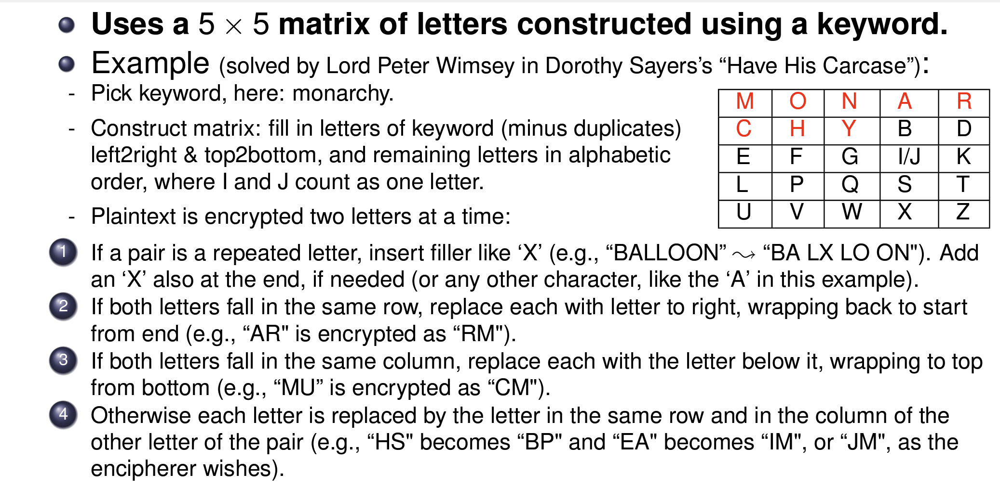

5. Polyalphabetic substitution ciphers (Vigenère cipher)
   - A polyalphabetic substitution cipher based on a tableau where each row is a Caesar Cipher with incremental shift.
   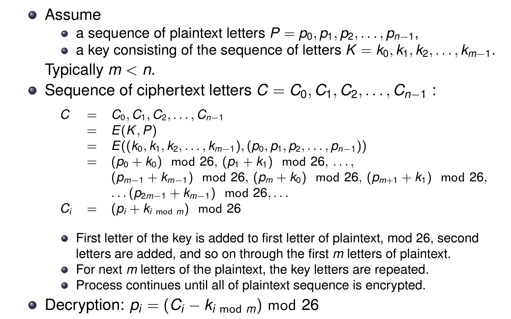

6. Vernam cipher: XOR
   - It works on binary data (bits) rather than letters, using **XOR**, $A \oplus B$.
   - $P \oplus K = C$, $C \oplus K = P$

7. One-time pad
   - Improvement to Vernam, use a truly random key that is: as long as the message, so that the key need not be repeated, used to encrypt and decrypt a single message, and then discarded.

#### Transposition 
1. Rail fence cipher:
   - 

2. Rotating (turning) grilles
   - 

3. Multiple-stage columnar transposition cipher

### Week 4
#### Steganography and Composite ciphers
   - Conceal the existence of the message. For example, Arrangement of words or letters, Invisible ink, Pin punctures.
   - General model of Steganography
   - 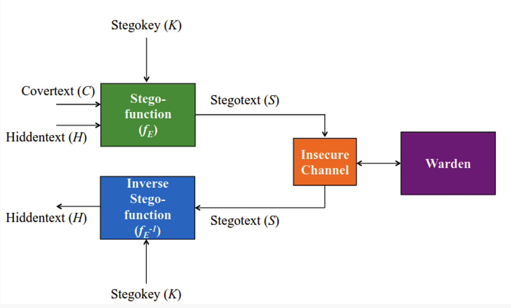
   - Watermarking and DRM (Digital Rights Management)
   - Product ciphers chain substitution-transposition combinations. One example is Rotor machines used in WW2. Used a series of cylinders, each giving one substitution, which rotated and changed after each letter was encrypted.

#### Feistel cipher
   - 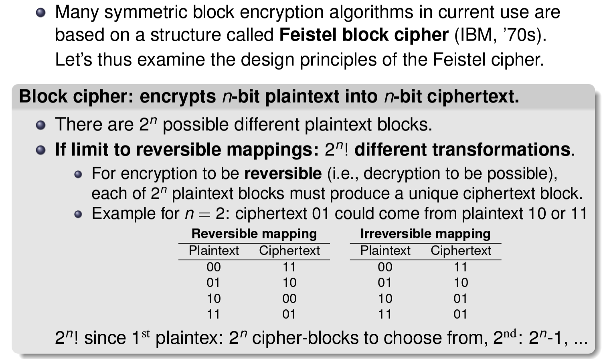
   - Small block size (e.g., n = 4): equivalent to a classical cipher and thus easily attackable. However, large block size: not practical implementation and performance. So, Feistel's suggestion is **invertible product cipher**.
   - **Product cipher**: Execution of 2 or more simple ciphers in sequence so that the result is cryptographically stronger. Alternates substitutions and permutations.
   - **S-Boxes and P-Boxes**, a proposal by Shannon to develop a product cipher that alternates confuse and diffusion functions. S-Boxes "confuse" input bits; P-Boxes "diffuse" bits across S-box inpus.
   - 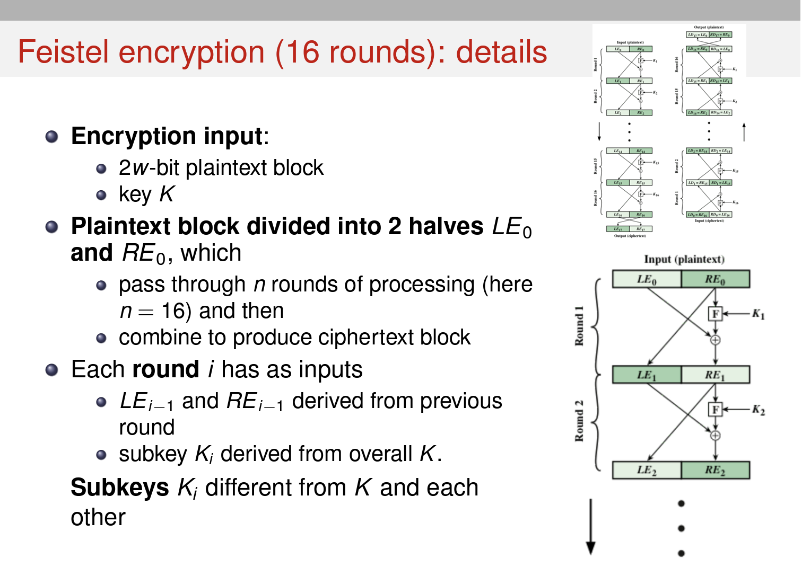
   - A substitution is performed on LEi by applying a **round function** F to REi and then XORing output with LEi.F has same general structure for each round is parameterized by round subkey Ki. Then a permutation is performed: interchange of two halves of data.
   - Intermediate value of decryption process equal to corresponding value of encryption process with two halves of value swapped. LD16 - i || RD16 - i = REi || LEi
   - 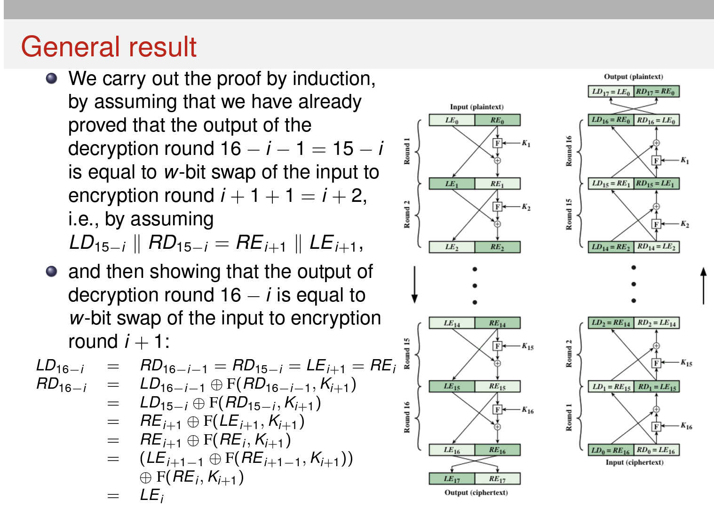

### Week 5
#### DES, the Data Encryption Standard
   - 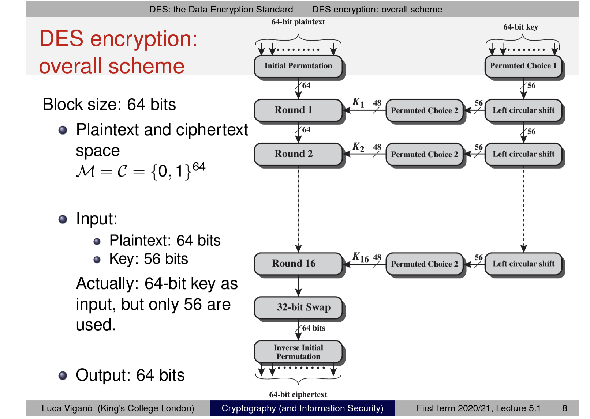
   - If a 64-bit DES key is divided into 8 bytes, then the sum of the eight bit of each byte is odd. This means that 7 of the 8 bits determine the value of the 8th bit.
   - IP and IP-1 has no real cryptographic significance.
   - Initially, key is passed through a **permutation** function(64 $\rightarrow$ 56), for each of 16 rounds, a subkey Ki is produced by combination of a **left cicular shift** and a permutation.
   - 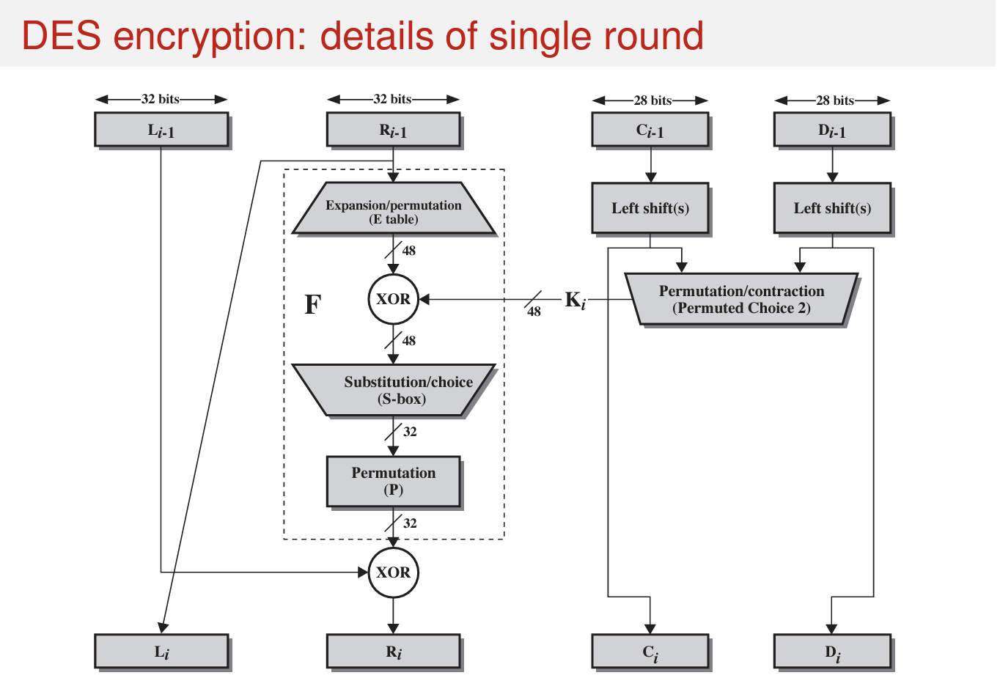
   - Substitution consists of a set of 8 S-boxes, each of which accepts 6 bits as input and produces 4 bits as output. For each Si(4 * 16 matrix), first and last bits of the input to form a 2-bit number to select row, and middle 4 bits select column, then select a number to produce 4-bit output.
   - Security of DES: differential analysis, linear analysis and exhaustive search of the key space.
   - Triple DES, use 3 stages of encryption with 2 keys Key1, Key2, also can use three different keys.

#### AES, Advanced Encryption Standard

### Week 6
#### Block cipher modes of operation
1. Electronic Codebook(ECB)
- Plaintext message broken into N independent blocks Pi, each block encrypted individually with the same key, Ci = E(K, Pi). And each ciphertext block is decrypted also individually.
- ECB is not recommended for messages longer than a block, cuz same block of plaintext always produces the same ciphertext, and for example, the message is highly structured.
- Ideal for a short amount of data, such as an encryption key, e.g., to transmit a DES key.
2. Cipher-block Chaining (CBC)
- For C0 = IV(initialization Vector) and 1 < i <= n:   
  $C_1 = E(K, IV \oplus P_1)$     
  $C_i = E(K, C_{i-1} \oplus P_i)$    
  $P_i = D(K, C_i) \oplus C_{i-1}$ 
- IV: A data block that is that same size as cipher block.
- Identical plaintext blocks mapped to different ciphertext.    
  Chaining dependencies: Ci depends on all preceding plaintext.    
  Self-synchronizing: if an error occurs in Ci but not in Ci + 1, then Ci + 2 is correctly decrypted.
- CBC appropriate for encrypting messgaes of length greater than b bits, and can be used for confidentiality and for authentication.
3. Cipher Feedback (CFB)
- Rather than blocks of b bits, plaintext is divided into segments(a.k.a. "units of transmission") of s bits.
- 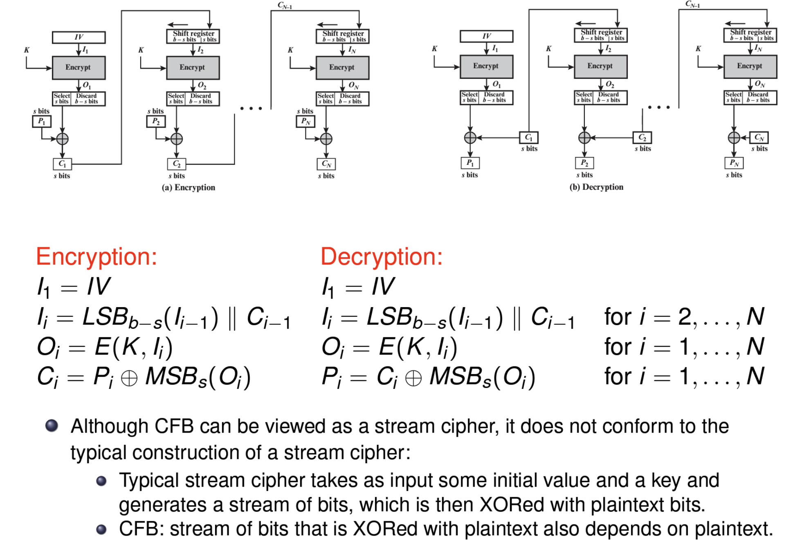
4. Output Feedback (OFB)
- Similar in structure to CFB, except for 2 differences:    
  Output of encryption function is fed back to shift register.      
  OFB operates on full blocks, not on an s-bit subset.
- 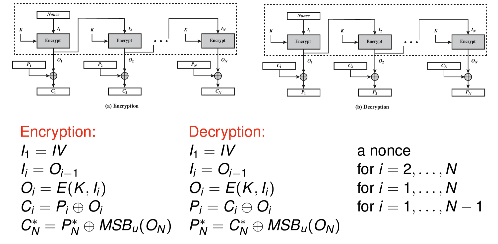

#### Pubilc-Key Cryptography
- Consider transformation pairs (Ee, Dd) where knowing Ee it is infeasible, given c, to find an m such that Ee(m) = c.
- 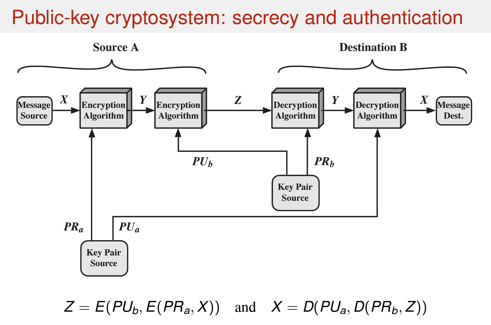
- Applications: Encryption/Decryption, Key Exchange, Digital Signature
- public-key cryptanalysis: brute-force attacks, computing private key from public key, probable-message attack.

### Week 7
#### Number theory
- Extended Euclid's Algorithm
- Modular arithmetics